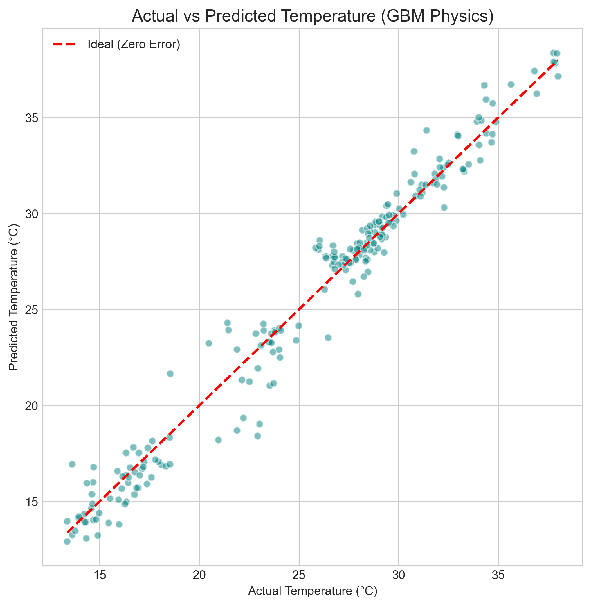
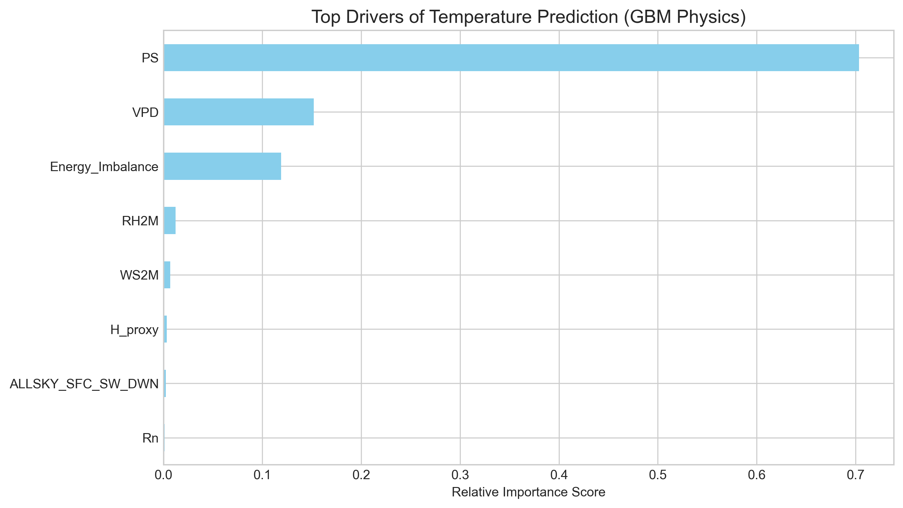
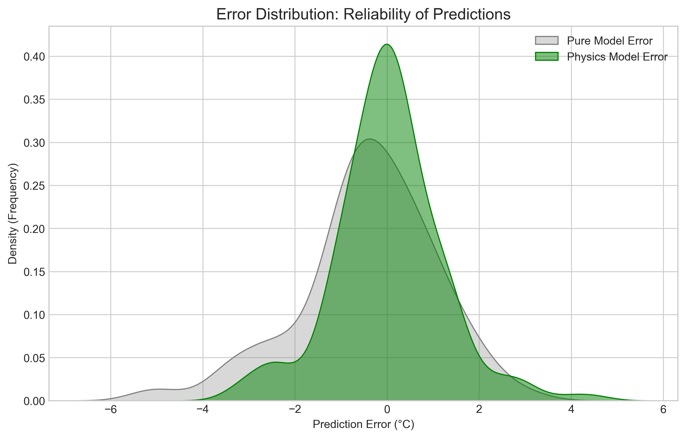
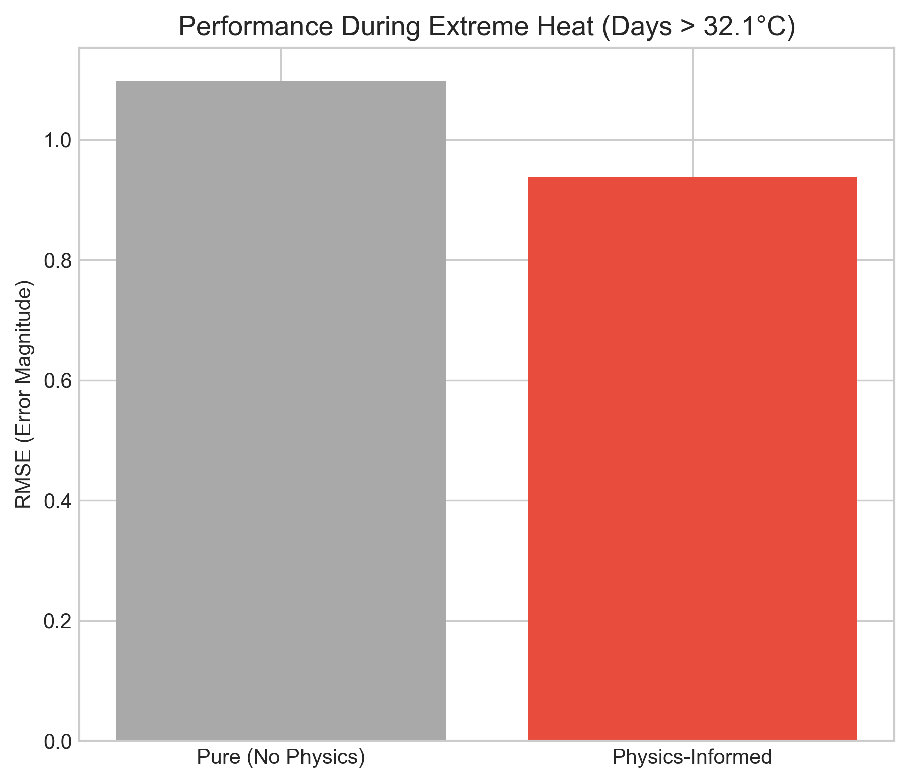

# Physics-Informed ML for Air Temperature Prediction 🌡️

This project implements a **Physics-Guided Machine Learning** approach to predict daily air temperature. Instead of relying solely on historical patterns, this model incorporates the **Surface Energy Balance (SEB)** equation to improve accuracy and physical consistency.

## Overview
Traditional ML models often treat meteorological variables as independent numbers. This project uses **Physics-Guided Feature Engineering** to inject domain knowledge into Gradient Boosting and Random Forest models.

### The Physics: Surface Energy Balance
We approximate the following physical drivers from raw NASA POWER data:
* **Net Radiation ($R_n$):** The total energy available at the surface.
* **Vapor Pressure Deficit (VPD):** The "drying power" of the air, a proxy for Latent Heat Flux.
* **Sensible Heat Proxy ($H_{proxy}$):** Modeling heat exchange between the surface and air using wind speed and temperature gradients.
* **Energy Imbalance:** A feature representing the residual energy, forcing the model to recognize thermodynamic inconsistencies.

## Key Results
By adding physical proxies, we achieved a significant reduction in error compared to pure data-driven baselines.

| Model | RMSE (Lower is Better) | $R^2$ (Higher is Better) |
| :--- | :--- | :--- |
| **Pure GBM (Baseline)** | 1.533 | 0.945 |
| **Physics-Informed GBM** | **1.169** | **0.968** |

**Improvement:** The Physics-Informed Gradient Boosting model reduced prediction error by **~24%**.

## 📊 Results & Visualization

### 1. Actual vs. Predicted
The model shows a strong linear correlation, with predictions tightly hugging the ideal 45-degree line.


### 2. The Impact of Physics
Our analysis proves that physical drivers like Surface Pressure (PS) and VPD are more influential than raw humidity or wind speed.


### 3. Reliability Analysis
The Physics-Informed model (Green) shows a much narrower error distribution compared to the Pure ML model (Grey), indicating higher reliability and fewer "extreme" misses.


### 4. Extreme Heat Performance
The model was specifically tested on days exceeding 32.1°C. The integration of thermodynamics allowed the model to maintain stability where standard AI typically fails.


### Setup 
```bash
python -m venv venv
source venv/bin/activate  # On Mac/Linux
pip install -r requirements.txt
python backend/fetch_data.py
python backend/preprocess.py
python backend train_model.py

